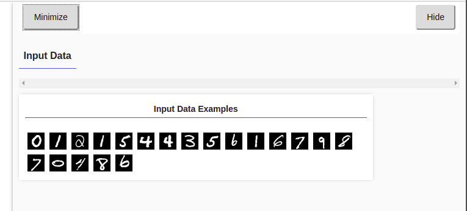
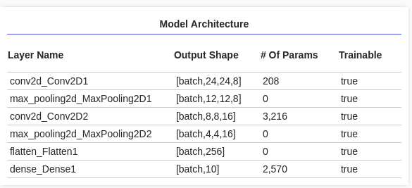
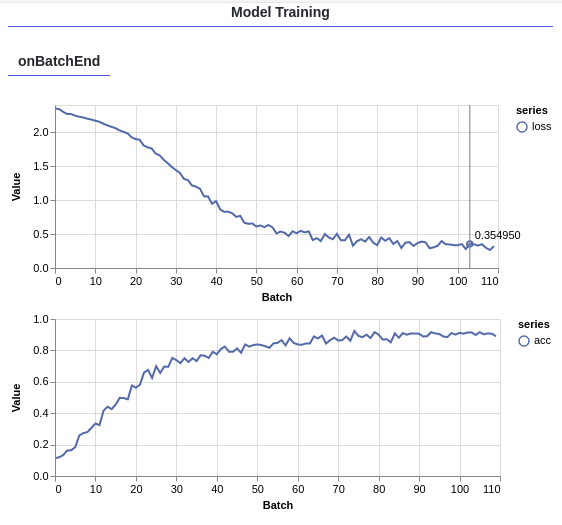
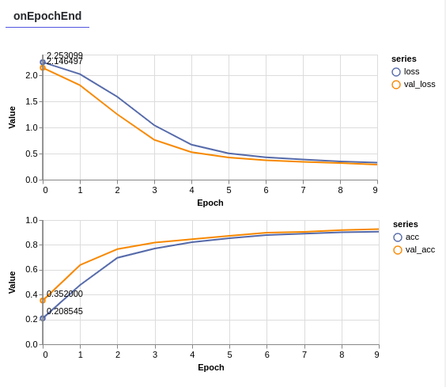
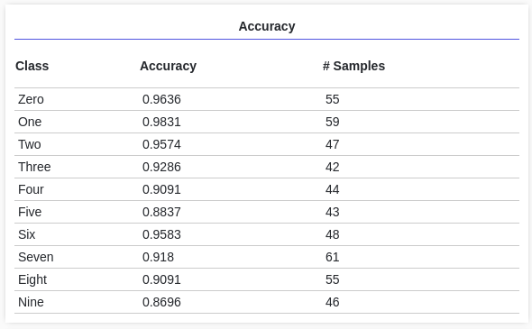
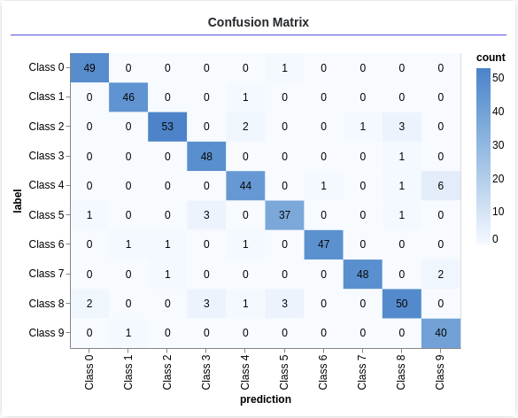

## Input Data Visualization

Each image is 28px wide 28px high and has a 1 color channel as it is a grayscale image. So the shape of each image is [28, 28, 1].

## Important Links
- [Image kernels explained Visually](http://setosa.io/ev/image-kernels/)
- [Convolutional Neural Networks for Visual Recognition](http://cs231n.github.io/convolutional-networks/)
- [Good Kernel Initializer Choice](https://js.tensorflow.org/api/latest/#Initializers)

## Model Architecture

## Model Training On Batch End

## Model Training on Epoch End 

## Accuracy

## Conftusion Matrix
