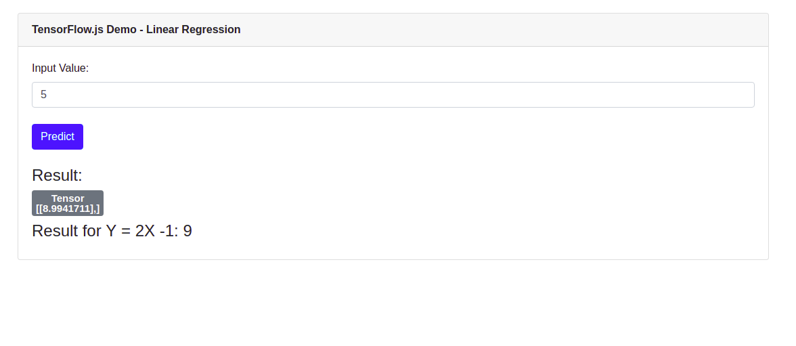

# Basic Tensor
Tensors: Central unit of data

tf.tensor([values], [num_of_row, num_of_col])
result
[[1, 2, 3, 4],
[5, 6, 7, 8]]

```JS
const t1 = tf.tensor([1, 2, 3, 4, 5, 6, 7, 8], [2, 4]); 
```
#### Tensor without defining the shape

```js
const t2 = tf.tensor([1, 2, 3, 4], [5, 6, 7, 8]);

tf.scaler // creates a single variable
tf.tensot1d // 1d array
tf.tensot2d
tf.tensot3d
```
#### Creating a tensor with all values set to zero
Result:  
([0, 0, 0],
 [0, 0, 0])

```js
const t_zeros = tf.t_zeros([2, 3]);
```
One drawback of tensor is if it's once created cannot be changes afterwords.

Tensors operations always return new tensor
#### tensor operation

```js
const t3 = tf.tensor2d([1,2], [3, 4]);
const t3_squared = t3.square();
```

## Project Set up
create package.json file. managing dependencies by Node.js package manager

```cmd
npm init -y
```

#### Web Application bundler
- installing parcel web app bundler

```bash
npm install -g parcel-bundler

```

#### Adding bootstrap library
```bash
npm install bootstrap
```
#### start the build process and the development web server by using the parcel command in the following way:
```bash
parcel index.html
```

## Adding TensorFlow.js
```bash
npm install @tensorflow/tfjs
```

## The Project:
This project predicts value of Y for a linear function Y = 2X - 1



[Tutorial](https://codingthesmartway.com/tensorflow-js-crash-course-machine-learning-for-the-web-getting-started/)